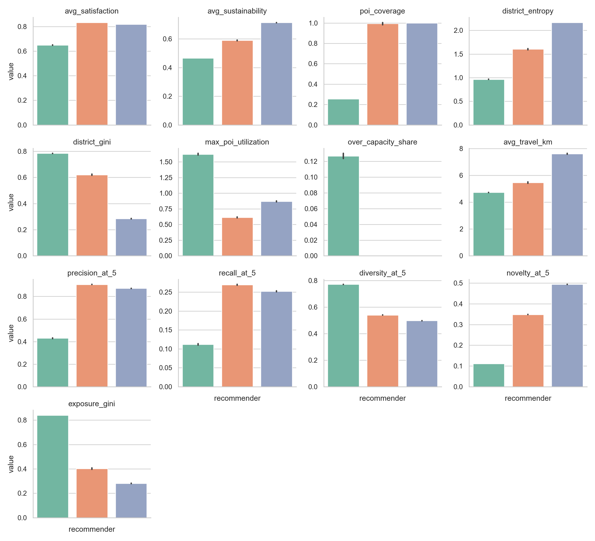
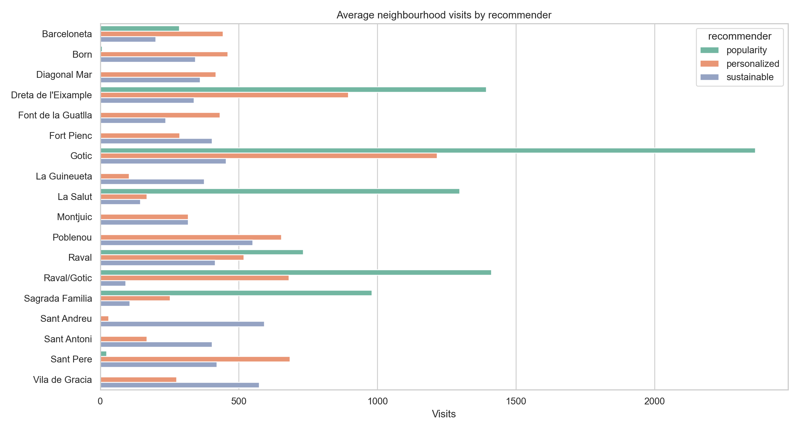

# Sustainable POI Recommender Evaluation

**City:** Barcelona  
**Framework:** Mesa agent-based simulation  
**Scale:** 51 POIs, 3 recommender strategies, 3 runs, 3,000 tourists per run  
**Artifact:** Python simulator, generated evaluation outputs, and an optional web interface

## Executive Summary

This project evaluates whether a sustainability-aware recommender can improve tourist management compared with two simpler baselines: popularity-based recommendations and personalized interest-based recommendations.

The main result is that the sustainability-aware strategy improves city-level outcomes: it distributes tourists more evenly, increases POI coverage, improves recommendation novelty, reduces exposure inequality, and avoids over-capacity visits in the generated runs. The tradeoff is a small satisfaction decrease compared with the pure personalized recommender and a longer average travel distance.

## Experiment Design

| Component | Implementation |
|---|---|
| Agent framework | Mesa |
| City | Barcelona |
| POIs | 51 synthetic but plausible POIs with real coordinates |
| Tourists | Generated agents with interests, budget, mobility, crowd aversion, sustainability sensitivity, family status, and walking tolerance |
| Strategies | Popularity, personalized, sustainability-aware |
| Simulation | Tourists receive recommendations, choose visits, update crowding and district indicators dynamically |
| Outputs | CSV metrics, recommendation logs, itinerary logs, plots, and optional web interface |

The included output set was generated with:

```bash
python run_experiment.py --tourists 3000 --runs 3 --output outputs
```

## Recommender Strategies

| Strategy | What It Optimizes | Expected Weakness |
|---|---|---|
| Popularity | Famous attractions and mainstream demand | Overcrowding and low coverage |
| Personalized | Tourist-interest match and practical constraints | Can still concentrate demand in central/popular districts |
| Sustainable | Interest match plus sustainability, local value, low crowding, and under-visited districts | Slightly longer travel and possible satisfaction tradeoff |

## City-Management Results

| Recommender | Satisfaction | Sustainability | POI Coverage | District Entropy | District Gini | Max Utilization | Over-Capacity Share | Travel km |
|---|---:|---:|---:|---:|---:|---:|---:|---:|
| Popularity | 0.648 | 0.465 | 0.255 | 0.965 | 0.783 | 1.622 | 0.127 | 4.729 |
| Personalized | 0.832 | 0.589 | 0.993 | 1.603 | 0.620 | 0.615 | 0.000 | 5.461 |
| Sustainable | 0.817 | 0.713 | 1.000 | 2.165 | 0.284 | 0.869 | 0.000 | 7.608 |



## Recommendation Results

| Recommender | Precision@5 | Recall@5 | Diversity@5 | Novelty@5 | Exposure Gini |
|---|---:|---:|---:|---:|---:|
| Popularity | 0.430 | 0.112 | 0.771 | 0.111 | 0.840 |
| Personalized | 0.906 | 0.269 | 0.541 | 0.348 | 0.402 |
| Sustainable | 0.871 | 0.252 | 0.498 | 0.493 | 0.281 |

Interpretation:

- Personalized recommendations produce the highest precision and satisfaction.
- Popularity recommendations have high exposure inequality and low novelty.
- Sustainable recommendations keep strong relevance while improving novelty and exposure fairness.

## Spatial Distribution

The popularity strategy concentrates visits in a small number of central, famous POIs. The sustainable strategy spreads visits across more POIs and districts.



The accompanying web interface includes an OpenStreetMap/Leaflet map with accurate POI coordinates and visit-sized markers.

## Movement Analysis

The simulator records tourist movement legs in `outputs/itineraries.csv` and aggregated district transitions in `outputs/movement_transitions.csv`.

The sustainable recommender has a higher average travel distance. This is expected: it deliberately distributes tourists farther across Barcelona instead of concentrating them around the same central attractions. This should be discussed as a policy tradeoff, not simply as a negative result.

## Main Conclusion

The sustainability-aware recommender improves collective tourism-management outcomes while preserving most of the user satisfaction of the personalized recommender.

In short:

| Goal | Best Strategy |
|---|---|
| Highest satisfaction | Personalized |
| Best sustainability score | Sustainable |
| Best POI coverage | Sustainable |
| Best district fairness | Sustainable |
| Lowest exposure inequality | Sustainable |
| Lowest overcrowding | Personalized / Sustainable |
| Shortest travel | Popularity |

## Remaining Gaps

These are the main things still missing or simplified:

| Gap | Why It Matters | Priority |
|---|---|---|
| Real POI attribute data | Capacity, popularity, prices, and sustainability scores are synthetic | High |
| Opening hours and time slots | Current crowding is dynamic, but occupancy does not decay realistically over the day | High |
| Public transport network | Distances are geographic estimates, not route-based travel times | Medium |
| Sensitivity analysis | Sustainability weights should be tested under different parameter settings | High |
| Tourist compliance levels | The simulator assumes tourists mostly follow recommendations | Medium |
| Trust/explanation model | The system does not yet simulate whether users trust sustainable suggestions | Medium |
| Statistical testing | Results are averaged, but no confidence intervals or significance tests are reported | Medium |
| Real validation data | No comparison against real Barcelona visitor flows | High |

## Limitations

The POI list and many POI attributes are synthetic but plausible. This is acceptable for a seminar prototype, but the conclusions should be framed as simulation evidence rather than empirical proof. The project demonstrates an evaluation methodology, not a production tourism-management system.

## Output Files

| File | Purpose |
|---|---|
| `outputs/summary_metrics.csv` | Run-level evaluation metrics |
| `outputs/poi_visits.csv` | POI-level visits, utilization, coordinates |
| `outputs/neighbourhood_visits.csv` | Neighbourhood-level distribution |
| `outputs/recommendations.csv` | Full recommendation-event log |
| `outputs/recommendations_sample.csv` | Smaller GUI sample |
| `outputs/itineraries.csv` | Full tourist movement log |
| `outputs/movement_summary.csv` | Movement summary by recommender |
| `outputs/movement_transitions.csv` | District-to-district transition counts |
