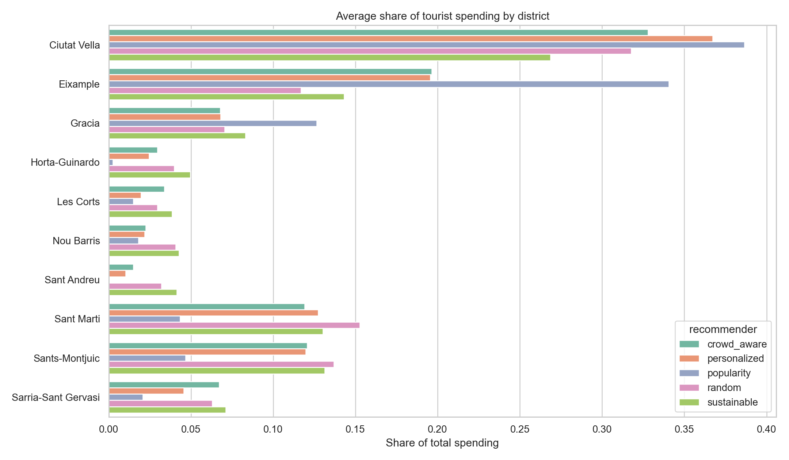
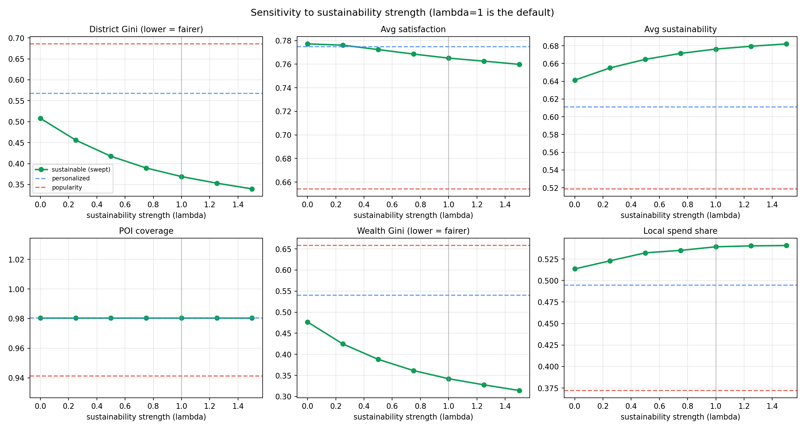
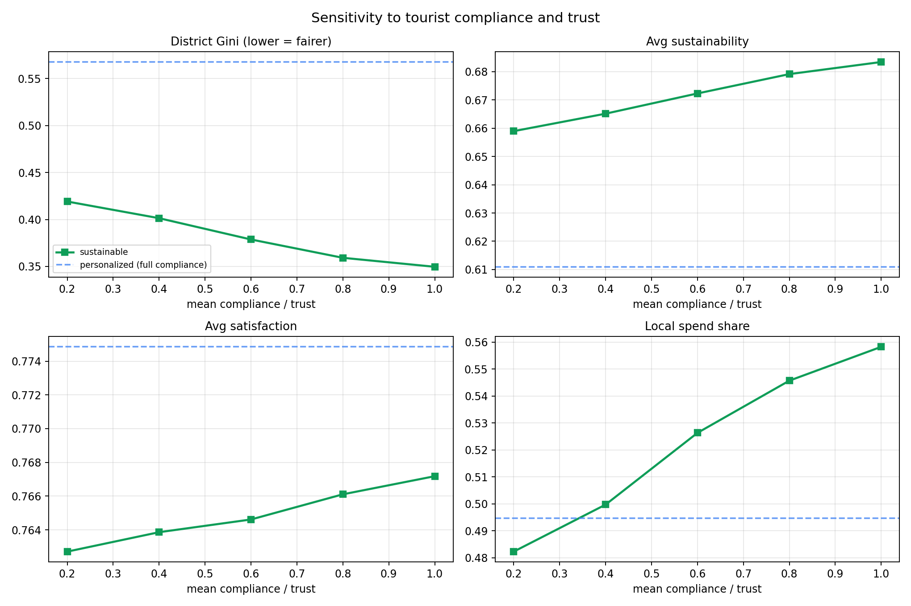

# Sustainable POI Recommender Evaluation

**City:** Barcelona
**Framework:** Mesa agent-based simulation
**Scale:** 51 POIs, 3 recommender strategies, 10 runs, 4,000 tourists per run (matched-seed blocked design)
**Artifact:** Python simulator, generated evaluation outputs with statistical analysis and sensitivity sweeps, and an optional web interface

## Executive Summary

This project evaluates whether a sustainability-aware multi-criteria recommender can improve city-level tourism management compared with two simpler baselines: a popularity-based recommender and a personalized interest-based recommender. The evaluation is an agent-based simulator in which thousands of heterogeneous tourist agents receive recommendations, decide which POIs to actually visit under time, budget, crowding and compliance constraints, and thereby drive crowding and spending indicators across the city.

The central result is that the sustainability-aware strategy clearly improves collective outcomes. Relative to the personalized baseline it distributes visitors far more evenly across districts (district Gini 0.378 vs 0.557), distributes tourist **spending** more evenly (wealth Gini 0.348 vs 0.528) and raises the share captured by local-economy POIs (0.523 vs 0.488), while raising the average sustainability of visited POIs (0.670 vs 0.614) and recommendation novelty (0.432 vs 0.336). It does this at a very small satisfaction cost (0.748 vs 0.756) and a longer average travel distance (7.46 km vs 6.08 km per tourist). All of these differences are statistically significant under paired tests across runs.

Compared with the popularity baseline the gap is much larger: popularity overcrowds badly (57.6% of arrivals occur while a POI is over its instantaneous capacity, against 16.3% for both other strategies) and concentrates roughly 73% of all tourist spending into just two central districts.

Two findings are deliberately reported as nuance rather than hidden. First, the sustainable recommender produces **higher transient peak occupancy** than the personalized one (peak ratio 2.21 vs 1.58), because it funnels demand toward a smaller set of lower-capacity local and under-visited POIs; it still avoids sustained over-capacity far better than popularity. Second, its advantages **degrade as tourist compliance and trust fall**: when tourists increasingly ignore sustainable nudges, district fairness and local-spending gains shrink back toward the personalized baseline.

## Experiment Design

| Component | Implementation |
|---|---|
| Agent framework | Mesa |
| City | Barcelona |
| POIs | 51 synthetic but plausible POIs with real coordinates, opening hours, capacities, and sustainability/local-value/cultural attributes |
| Tourists | Generated agents with interests, budget, mobility mode, walking tolerance, crowd aversion, sustainability sensitivity, outdoor preference, family status, a start hour and time budget, and a compliance/trust level |
| Strategies | Popularity, personalized, sustainability-aware (with a tunable sustainability strength) |
| Simulation | Event-driven day: tourists arrive, request recommendations, choose feasible visits, occupy POIs for their visit duration, then depart; crowding, spending and district indicators update in real time |
| Replication | 10 runs; within a run all three strategies share one seed, so they face an identical tourist population (a randomised complete block design) |
| Analysis | Run-level metrics, 95% confidence intervals, paired significance tests with Holm correction and Cohen's d, plus two sensitivity sweeps |
| Outputs | CSV metrics, recommendation logs, itinerary logs, district-spending data, plots, statistical tables, and an optional web interface |

The included output set was generated with:

```bash
python run_experiment.py --tourists 4000 --runs 10 --output outputs
python sensitivity.py   --tourists 3000 --runs 5  --output outputs
```

`run_experiment.py` automatically calls `stats.py` at the end; it can also be run on its own against an existing `outputs/summary_metrics.csv`.

## Recommender Strategies

| Strategy | What It Optimizes | Expected Weakness |
|---|---|---|
| Popularity | Famous attractions and mainstream demand | Overcrowding and low coverage |
| Personalized | Tourist-interest match and practical constraints | Can still concentrate demand in central, popular districts |
| Sustainable | Interest match plus sustainability, local value, cultural value, low instantaneous crowding, and under-visited districts | Slightly longer travel, a small satisfaction tradeoff, and transient peaks at small POIs |

The three recommenders are intentionally simple mock-ups (linear scoring functions over POI and tourist attributes), as agreed for this seminar: the goal is to *evaluate* a sustainability-aware recommender against baselines, not to build a full multi-criteria ELECTRE system. The sustainable recommender multiplies all of its sustainability-oriented terms (sustainability, local value, under-visited-district bonus, low-crowding bonus) by a single **sustainability strength** parameter `lambda`. At `lambda = 0` it collapses toward a personalized recommender; `lambda = 1` is the default used for the headline results. This parameter is the subject of the first sensitivity sweep.

## Temporal Simulation Model

The most important change over the first version of this project is how crowding is modelled. Previously, crowding at a POI was a cumulative visit counter divided by capacity. That had two problems: it depended on the order in which agents were processed, and occupancy never decreased, so a POI that was busy in the morning still counted as "full" at night. Crowding is fundamentally a function of *time of day*, and the old model could not represent that.

The simulator now runs an **event-driven day**. Each tourist has a start hour drawn around mid-morning and a personal time budget. The model maintains a priority queue of timed events of two kinds: a *decision* event, when a tourist evaluates recommendations and picks the next feasible POI; and a *departure* event, scheduled at arrival time plus the POI's visit duration. Arrivals raise a POI's live occupancy, departures lower it, and decisions are processed in true chronological order. Crowding is therefore the **instantaneous occupancy** a tourist actually experiences on arrival, not a running total.

To turn daily capacities into instantaneous ones we apply a steady-state (Little's-law-style) conversion. If a POI serves a given number of visitors over an active day window and each stays for its visit duration, the expected number present at once is

```
instantaneous_capacity = daily_capacity * visit_duration / active_day_window
```

with an active day window of 10 hours. A tourist's crowd response, satisfaction penalty and skip probability all use live occupancy against this instantaneous capacity. This yields a genuinely time-varying occupancy profile and two new, more honest crowding metrics:

- **Peak occupancy ratio** — the maximum, over the day and over POIs, of live occupancy divided by instantaneous capacity. It captures the worst transient crush.
- **Temporal over-capacity share** — the fraction of all arrivals that occur while the chosen POI is already over its instantaneous capacity. This replaces the old, order-dependent daily over-capacity figure as the primary overcrowding indicator.

The daily over-capacity share is still reported for continuity, but the temporal metrics are the ones that matter.

## Tourist Behaviour: Compliance and Trust

The first version implicitly assumed tourists follow whatever they are recommended. Real nudges are only partially adopted, so each tourist now carries two related traits, both drawn from Beta distributions around configurable means: a **compliance** level (general willingness to follow the recommender) and a **trust in sustainability** level (specific willingness to act on a sustainability-motivated suggestion).

At each decision a tourist follows the recommender with probability equal to its compliance, and for the *sustainable* recommender that probability is further scaled by trust, so a low-trust tourist discounts sustainable nudges specifically. A tourist who does not follow the recommender instead chooses from the union of the recommended list and its own top personal favourites, ranked by its own interest match — i.e. it defects toward what it personally wants, typically the famous, central, interest-matching spots. This is why the sustainable recommender's *effective* follow rate (reported as average compliance, 0.532) is lower than the baselines' (0.721): some tourists actively decline its less-famous suggestions. The mean compliance and trust are model parameters and form the second sensitivity sweep.

## Wealth Distribution Model

The brief explicitly asks about distributing tourists **and their wealth** across the city, so the simulator now models spending. Each visit generates spending equal to the POI's entrance price plus a local-economy component proportional to the POI's local-value attribute (markets, neighbourhood high streets, local cultural venues capture more), and that spending is attributed to the POI's district and neighbourhood. From this we compute a **wealth Gini** across districts, a wealth entropy, a neighbourhood-level spending Gini, and a **local-spend share** (the fraction of all spending captured by above-median-local-value POIs). These let us check whether a strategy spreads economic benefit, not just foot traffic.

## City-Management Results

Means across 10 runs at 4,000 tourists each. Lower is better for the Gini and over-capacity columns; higher is better for the rest.

| Recommender | Satisfaction | Sustainability | POI Coverage | District Entropy | District Gini | Peak Occ. Ratio | Temporal Over-Cap | Wealth Gini | Local Spend Share | Travel km |
|---|---:|---:|---:|---:|---:|---:|---:|---:|---:|---:|
| Popularity | 0.646 | 0.523 | 0.959 | 1.431 | 0.682 | 2.560 | 0.576 | 0.651 | 0.382 | 5.474 |
| Personalized | 0.756 | 0.614 | 0.980 | 1.756 | 0.557 | 1.577 | 0.163 | 0.528 | 0.488 | 6.079 |
| Sustainable | 0.748 | 0.670 | 0.982 | 2.056 | 0.378 | 2.208 | 0.163 | 0.348 | 0.523 | 7.459 |


Reading the table:

- **District fairness.** The sustainable recommender roughly halves district inequality relative to popularity (Gini 0.378 vs 0.682) and improves substantially on personalized (0.378 vs 0.557), with the highest district entropy.
- **Overcrowding.** Popularity is the clear loser: 57.6% of arrivals land on an already over-capacity POI. Personalized and sustainable are tied at 16.3%. However, the sustainable recommender has a *higher transient peak* than personalized (2.21 vs 1.58): by steering demand toward smaller local and under-visited POIs, it can briefly crowd them at popular hours even while avoiding sustained over-capacity. This is an honest tradeoff of the strategy, not an error.
- **Wealth.** The sustainable recommender produces the most even spending distribution (wealth Gini 0.348) and the highest local-economy capture (0.523), directly addressing the "distribute their wealth" goal.
- **Satisfaction.** Personalized is highest, but sustainable is only 0.008 behind it, and both are far above popularity.
- **Travel.** Sustainable tourists travel farthest, as expected from a strategy that deliberately spreads them across the city.

## Statistical Significance

Because the three strategies are evaluated on identical tourist populations within each run (matched seeds), runs act as blocks and the strategies can be compared with **paired** t-tests, which are more powerful than unpaired ones here. For each headline metric we report 95% confidence intervals per strategy and pairwise paired tests with **Holm-Bonferroni** correction across the three comparisons, plus a paired **Cohen's d** effect size. Full tables are in `outputs/confidence_intervals.csv` and `outputs/statistical_tests.csv`.

Selected 95% confidence intervals (mean across runs):

| Metric | Popularity | Personalized | Sustainable |
|---|---|---|---|
| District Gini | 0.682 [0.680, 0.685] | 0.557 [0.554, 0.559] | 0.378 [0.377, 0.380] |
| Wealth Gini | 0.651 [0.648, 0.653] | 0.528 [0.525, 0.531] | 0.348 [0.347, 0.350] |
| Avg sustainability | 0.523 [0.522, 0.524] | 0.614 [0.613, 0.615] | 0.670 [0.669, 0.671] |
| Temporal over-capacity | 0.576 [0.572, 0.580] | 0.163 [0.157, 0.168] | 0.163 [0.158, 0.168] |
| Local spend share | 0.382 [0.380, 0.384] | 0.488 [0.486, 0.491] | 0.523 [0.521, 0.526] |

Every sustainable-vs-personalized comparison on the city-management metrics is significant after correction: district Gini, wealth Gini, district entropy, sustainability, local-spend share and novelty all favour the sustainable recommender at `p < 0.0001`, and even the small satisfaction gap in favour of personalized is significant. Two comparisons are **not** significant, both sensibly: personalized and sustainable are statistically indistinguishable on temporal over-capacity share (p ≈ 0.98) and on POI coverage (p ≈ 0.34) — they are equally good on those axes.

A methodological caveat is worth stating plainly. At 4,000 tourists and 10 runs the simulation has very low run-to-run variance, so confidence intervals are extremely tight and Cohen's d values are large. Statistical significance is therefore easy to obtain and is not, by itself, strong evidence. The conclusion rests on the **practical magnitude** of the differences (halving a Gini coefficient, eliminating most over-capacity arrivals), with significance testing included as the methodological check the first version was missing rather than as the main argument.

## Recommendation Results

| Recommender | Precision@5 | Recall@5 | Diversity@5 | Novelty@5 | Exposure Gini |
|---|---:|---:|---:|---:|---:|
| Popularity | 0.425 | 0.109 | 0.768 | 0.118 | 0.823 |
| Personalized | 0.854 | 0.252 | 0.572 | 0.336 | 0.417 |
| Sustainable | 0.761 | 0.214 | 0.577 | 0.432 | 0.384 |

Interpretation:

- Personalized recommendations produce the highest precision, consistent with their highest satisfaction.
- Popularity recommendations have the worst exposure inequality (a few POIs dominate every list) and the lowest novelty.
- Sustainable recommendations keep strong relevance (precision 0.761) while delivering the highest novelty and the fairest exposure across POIs. The precision gap to personalized (0.093) is the recommendation-quality price of its city-level benefits.

## Spatial and Wealth Distribution

The popularity strategy concentrates visits in a few central, famous POIs; the sustainable strategy spreads visits across more POIs and districts.


The spending model makes the wealth concentration concrete. The table below shows each district's mean share of total tourist spending under each strategy.

| District | Popularity | Personalized | Sustainable |
|---|---:|---:|---:|
| Ciutat Vella | 0.387 | 0.367 | 0.269 |
| Eixample | 0.341 | 0.196 | 0.143 |
| Gracia | 0.126 | 0.068 | 0.083 |
| Sants-Montjuic | 0.047 | 0.120 | 0.131 |
| Sant Marti | 0.043 | 0.127 | 0.130 |
| Sarria-Sant Gervasi | 0.021 | 0.046 | 0.071 |
| Nou Barris | 0.018 | 0.022 | 0.043 |
| Les Corts | 0.015 | 0.020 | 0.038 |
| Horta-Guinardo | 0.003 | 0.025 | 0.050 |
| Sant Andreu | 0.000 | 0.010 | 0.041 |



Under popularity, Ciutat Vella and Eixample alone capture about 73% of all tourist spending, while peripheral districts such as Sant Andreu, Horta-Guinardó, Les Corts and Nou Barris receive almost nothing. The sustainable recommender cuts the two central districts to about 41% combined and multiplies the share reaching every outer district — Sant Andreu goes from essentially zero to 0.041, Horta-Guinardó from 0.003 to 0.050. The accompanying web interface includes an OpenStreetMap/Leaflet map with accurate POI coordinates and visit-sized markers.

## Movement Analysis

The simulator records every tourist movement leg in `outputs/itineraries.csv` and aggregated district transitions in `outputs/movement_transitions.csv`. Per-leg summaries:

| Recommender | Avg leg distance (km) | Cross-district share | Unique district transitions |
|---|---:|---:|---:|
| Popularity | 2.01 | 0.395 | 97 |
| Personalized | 2.24 | 0.444 | 109 |
| Sustainable | 2.80 | 0.480 | 109 |

The sustainable recommender has the longest legs and the highest cross-district movement share. This is expected and is a deliberate policy tradeoff: it distributes tourists farther across Barcelona rather than concentrating them around the same central cluster. In a city aiming to relieve pressure on its core, longer and more dispersed trips are part of the intended effect, but they have a real cost in tourist travel time and should be weighed as such.

## Sensitivity Analysis

### Sustainability strength

The first sweep varies the sustainable recommender's strength `lambda` from 0 to 1.5 (5 runs per point, 3,000 tourists), with the personalized and popularity baselines as horizontal references.



| lambda | District Gini | Satisfaction | Sustainability |
|---:|---:|---:|---:|
| 0.00 | 0.508 | 0.777 | 0.641 |
| 0.50 | 0.417 | 0.772 | 0.665 |
| 1.00 | 0.369 | 0.765 | 0.676 |
| 1.50 | 0.340 | 0.760 | 0.682 |

At `lambda = 0` the sustainable recommender sits close to the personalized baseline on both fairness and satisfaction, as designed. As `lambda` grows, district Gini and wealth Gini fall well below both baselines and sustainability rises, while satisfaction declines only gently. Most of the fairness gain is captured by `lambda` between 0.5 and 1.0, after which returns diminish. This shows the result is not an artefact of one weighting: the fairness-versus-satisfaction tradeoff is smooth and controllable, and the default `lambda = 1` is a reasonable operating point.

### Compliance and trust

The second sweep varies the mean tourist compliance and trust together from 0.2 to 1.0.



| Mean compliance/trust | District Gini | Sustainability | Local Spend Share |
|---:|---:|---:|---:|
| 0.20 | 0.419 | 0.659 | 0.482 |
| 0.60 | 0.379 | 0.672 | 0.526 |
| 1.00 | 0.350 | 0.683 | 0.559 |

As compliance falls, the sustainable recommender's benefits erode toward the personalized baseline: district Gini rises, sustainability drops, and at very low compliance the local-spend share even dips below the personalized reference. The interpretation is that a sustainability-aware recommender is only as effective as tourists' willingness to act on it, which motivates the trust/explanation direction in future work: making sustainable suggestions persuasive is as important as making them correct.

## Main Conclusion

The sustainability-aware recommender improves collective tourism-management outcomes — district fairness, wealth distribution, local-economy capture, sustainability and novelty — while preserving almost all of the user satisfaction of the personalized recommender. The improvements are statistically significant and, more importantly, practically large, and they are robust across a range of sustainability weightings.

| Goal | Best Strategy |
|---|---|
| Highest satisfaction | Personalized (sustainable a close second) |
| Best sustainability score | Sustainable |
| Best POI coverage | Sustainable / Personalized (tied) |
| Best district fairness | Sustainable |
| Most even wealth distribution | Sustainable |
| Highest local-economy capture | Sustainable |
| Lowest sustained overcrowding | Personalized / Sustainable (tied) |
| Lowest transient peak | Personalized |
| Shortest travel | Popularity |

The honest qualifications are that the sustainable strategy trades a little satisfaction and noticeably more travel for these gains, can transiently crowd small POIs, and depends on tourists actually complying with its suggestions.

## Addressed Since the First Version

Several gaps flagged in the original report are now implemented:

- **Opening hours and time-of-day crowding** — replaced the cumulative-counter crowding with an event-driven day, real opening hours, instantaneous capacities, and the peak-occupancy and temporal-over-capacity metrics.
- **Tourist compliance** — tourists now follow the recommender only probabilistically and otherwise defect to personal favourites.
- **Trust / explanation (partial)** — a trust-in-sustainability trait modulates adoption of sustainable nudges; full explanation modelling is still future work.
- **Statistical testing** — 95% confidence intervals, paired tests with Holm correction, and Cohen's d.
- **Sensitivity analysis** — two sweeps over sustainability strength and over compliance/trust.
- **Wealth distribution** — an explicit spending model with district/neighbourhood Gini and local-spend share, matching the brief's wording about distributing wealth.

## Remaining Gaps

| Gap | Why It Matters | Priority |
|---|---|---|
| Real POI attribute data | Capacities, popularity, prices and sustainability scores are synthetic | High |
| Real validation data | No comparison against measured Barcelona visitor flows | High |
| Public-transport routing | Distances are geographic estimates, not network/route-based travel times | Medium |
| Full explanation model | Trust is a scalar trait; the system does not yet model *why* a tourist trusts a suggestion or how explanations change behaviour | Medium |
| Multi-day and revisit dynamics | Each tourist is simulated for a single day with no repeat visits or memory | Low |

## Limitations

The POI list and many POI attributes are synthetic but plausible, and the behavioural, capacity and spending models are designed rather than calibrated to data. This is acceptable for a seminar prototype, but the conclusions should be read as **simulation evidence about a methodology**, not empirical proof about Barcelona. The instantaneous-capacity conversion and the spending model in particular are reasonable but unvalidated assumptions. The very low Monte Carlo variance means significance testing is a sanity check rather than the core of the argument; the practical magnitude and the sensitivity analysis carry more weight. The project demonstrates an evaluation framework for sustainability-aware recommenders, not a production tourism-management system.

## Output Files

| File | Purpose |
|---|---|
| `outputs/summary_metrics.csv` | Run-level evaluation metrics (all strategies, all runs) |
| `outputs/confidence_intervals.csv` | 95% confidence intervals per strategy and metric |
| `outputs/statistical_tests.csv` | Pairwise paired t-tests, Holm-corrected, with Cohen's d |
| `outputs/poi_visits.csv` | POI-level visits, utilization, coordinates |
| `outputs/neighbourhood_visits.csv` | Neighbourhood-level distribution |
| `outputs/district_spending.csv` | District-level visits and spending shares |
| `outputs/recommendations_sample.csv` | Sampled recommendation-event log for the web interface |
| `outputs/movement_summary.csv` | Movement summary by recommender |
| `outputs/movement_transitions.csv` | District-to-district transition counts |
| `outputs/sensitivity_strength.csv` | Sustainability-strength sweep results |
| `outputs/sensitivity_compliance.csv` | Compliance/trust sweep results |
| `outputs/metrics_comparison.png`, `neighbourhood_distribution.png`, `district_spending.png`, `sensitivity_strength.png`, `sensitivity_compliance.png` | Figures |

The full per-event logs (`recommendations.csv`, `itineraries.csv`) are regenerated by `run_experiment.py` but are large (well over 100 MB combined) and are not committed; the sampled and aggregated files above are sufficient for the report and the web interface.
